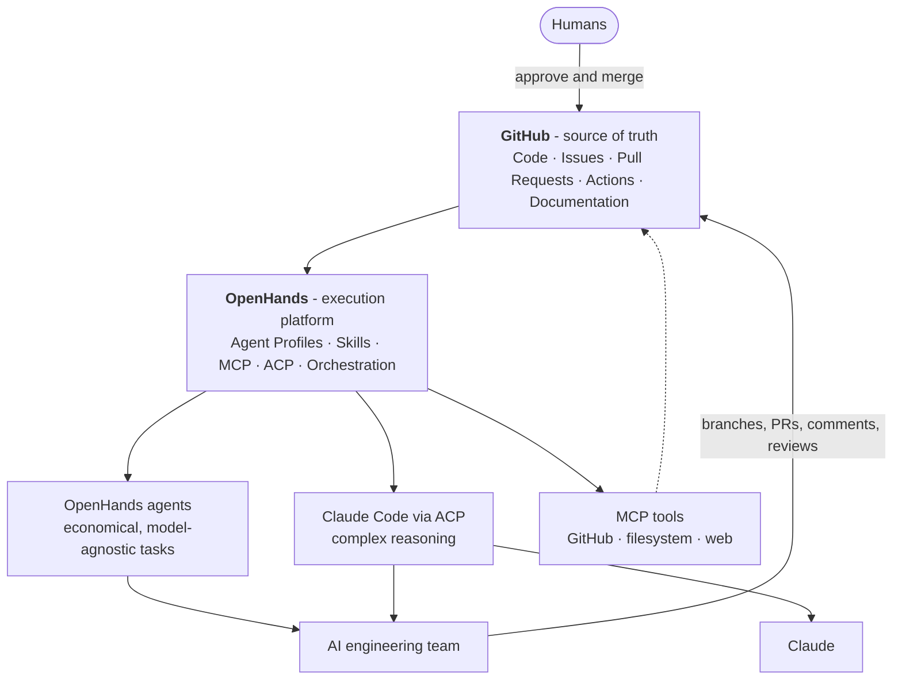
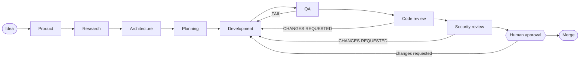

# openhands-agent-team

The source of truth for a self-hosted, multi-agent **AI software engineering team** powered by
[OpenHands](https://docs.openhands.dev). This repository defines *who* the agents are, *how* they
work, *what* they may touch and *how* work flows between them — as reviewable Markdown and YAML.

It contains **no application code**. It is the configuration, knowledge, process, governance and
orchestration specification that OpenHands agents follow when they work on your application
repositories, plus small tested helper scripts that the agents run (Python standard library only).

## Purpose

- Turn ideas into merged, reviewed, tested Pull Requests through specialised agents
  (product, research, architecture, planning, development, QA, code review, security review,
  orchestration).
- Keep **GitHub as the single record** of requirements, decisions, plans, code, reviews and state.
- Keep **humans in control**: agents never merge; humans approve ADRs, risk acceptance, team
  configuration changes and every merge.
- Keep the platform **small**: GitHub + one OpenHands installation, nothing else until an ADR
  justifies it.

## Architecture



| Principle | Meaning |
| --- | --- |
| GitHub is the source of truth | Issues, labels, PRs, reviews, docs and ADRs hold all project state |
| OpenHands executes agents | One installation; one Agent Profile per role |
| Skills hold procedures | Reusable, versioned `SKILL.md` files |
| Agent Profiles specialise roles | Role files define behaviour; profiles select backend, tools and secrets |
| MCP provides tools | GitHub, filesystem/repository, web/research |
| ACP brings Claude Code | For Architect, Developer and Code Reviewer |
| GitHub Actions validates deterministically | Never depends on the AI platform being online |
| Humans approve | Every production-impacting change |
| Minimal infrastructure | No LiteLLM, n8n, Mattermost, Kubernetes or per-agent servers initially |

Details: [docs/architecture.md](docs/architecture.md) and
[ADR-0001](docs/decisions/ADR-0001-agent-team-architecture.md).

## Agent team

| Agent | Mission | Backend | Skills |
| --- | --- | --- | --- |
| [Product Manager](agents/product-manager.md) | Ideas → clear, testable requirements | Subagent · haiku | product-management |
| [Researcher](agents/researcher.md) | Evidence-based research for decisions | Subagent · sonnet | research |
| [Architect](agents/architect.md) | Simplest sufficient architecture + ADRs | Subagent · opus | architecture, research |
| [Planner](agents/planner.md) | Requirements + design → small task Issues | Subagent · sonnet | planning, stack-routing |
| [Developer](agents/developer.md) | Implement `ai-ready` Issues as tested PRs, as the generalist or one of ten stack specialists | Subagents · sonnet | development, testing + `stack-*` |
| [QA Engineer](agents/qa-engineer.md) | Validate acceptance criteria and regressions | Subagent · haiku | testing |
| [Code Reviewer](agents/code-reviewer.md) | Semantic PR review in twelve dimensions | Subagent · sonnet | code-review |
| [Security Reviewer](agents/security-reviewer.md) | Find security weaknesses before merge | Subagent · sonnet | security-review |
| [Orchestrator](agents/orchestrator.md) | Coordinate agents and workflow state | Coordinator (sonnet) | orchestration, stack-routing |

All agents inherit the global contract in [AGENTS.md](AGENTS.md). Canonical definitions:
[config/agents.yaml](config/agents.yaml).

### Developer specialists

The coordinator profiles the target repository (`detect_stack.py`) and gives every task to the
developer who owns its stack (`select_specialist.py`), so a Spring Boot task is written by a
Spring Boot specialist and an Angular task by an Angular specialist
([ADR-0003](docs/decisions/ADR-0003-stack-specialist-developers.md),
[docs/subagents.md](docs/subagents.md#3-developer-specialists)):

| Specialist | Stacks |
| --- | --- |
| `developer-typescript` | TypeScript, JavaScript, Node.js (Express, Fastify, NestJS) |
| `developer-react` | React, React Native |
| `developer-nextjs` | Next.js |
| `developer-angular` | Angular |
| `developer-vue` | Vue, Nuxt |
| `developer-java-spring` | Java, Spring Boot |
| `developer-kotlin-android` | Kotlin, Android, Jetpack Compose, Ktor |
| `developer-python` | Python, FastAPI, Django, Flask |
| `developer-go` | Go |
| `developer-dotnet` | C#, ASP.NET Core |
| `developer` | Anything else, and cross-stack tasks that cannot be split |

Every developer uses the same tested helper scripts: baseline and regression checks
(`run_checks.py`), a focused code map (`repo_map.py`), related tests (`impact_scan.py`), a pre-push
self-review (`diff_guard.py`), checkpoints (`checkpoint.py`), the Pull Request body (`pr_body.py`) and
dependency vetting (`deps_check.py`).

The whole team runs in **one OpenHands conversation** with the profile `team`: the Orchestrator is
the coordinator (main session) and every other role is a Claude Code subagent with its own model,
restriction level and memory. You write one message (`Build: <idea>`) and the team stops only for ADR
acceptance and merges. See [docs/subagents.md](docs/subagents.md) and
[ADR-0002](docs/decisions/ADR-0002-single-session-subagent-team.md).

## Skills

| Skill | Procedure |
| --- | --- |
| [product-management](skills/product-management/SKILL.md) | Idea → Problem → Users → Goals → Scope → Requirements → Acceptance criteria → Risks → Issue |
| [research](skills/research/SKILL.md) | Question → Search strategy → Evidence → Evaluation → Findings → Trade-offs → Recommendation |
| [architecture](skills/architecture/SKILL.md) | Requirements and constraints → components, interfaces, data, cross-cutting concerns → alternatives → ADR |
| [planning](skills/planning/SKILL.md) | Requirements + architecture → ordered, traceable, `ai-ready` task Issues |
| [development](skills/development/SKILL.md) | Issue → branch → implement → test → lint → build → review diff → PR |
| [testing](skills/testing/SKILL.md) | Test strategy; `PASS` / `FAIL` / `BLOCKED` / `NOT APPLICABLE` with evidence |
| [code-review](skills/code-review/SKILL.md) | Twelve ordered dimensions; `BLOCKER` … `NIT` findings |
| [security-review](skills/security-review/SKILL.md) | Attack surface → 22 review areas → actionable findings |
| [orchestration](skills/orchestration/SKILL.md) | Route work, verify artifacts, detect stalls, escalate |

See [skills/README.md](skills/README.md) and [config/skills.yaml](config/skills.yaml).

## Workflow



- Research and architecture are conditional; QA, reviews and human approval are never skipped.
- Workflow state is visible in GitHub labels: exactly one `agent:*` label names the current owner.
- Every fix re-enters at QA; after three review cycles a human is pulled in.
- There is **no automatic merge**.

Full lifecycle, feedback loops, states and approval points: [docs/workflow.md](docs/workflow.md) and
[config/workflow.yaml](config/workflow.yaml). Inside a single agent run:
[docs/agent-lifecycle.md](docs/agent-lifecycle.md).

## Repository structure

```text
openhands-agent-team/
├── README.md                     This file
├── AGENTS.md                     Global operating contract inherited by every agent
├── CONTRIBUTING.md               How humans change this repository
├── SECURITY.md                   Secret handling and vulnerability reporting
├── LICENSE                       Apache License 2.0
├── plugin.json                   Makes the repository an OpenHands plugin (skills/)
├── agents/                       One role definition per agent (+ README)
├── skills/                       One operational SKILL.md per skill (+ README); stack-* skills,
│                                 references/ loaded on demand and scripts/ helpers
├── docs/
│   ├── architecture.md           Components, layers, enforcement model
│   ├── agent-lifecycle.md        What happens inside one agent run
│   ├── workflow.md               Team lifecycle with Mermaid diagrams
│   ├── github-integration.md     Issues, labels, PRs, reviews, branch protection
│   ├── openhands-integration.md  Repository vs runtime configuration, setup checklist
│   ├── acp-integration.md        Claude Code through ACP
│   ├── mcp-integration.md        MCP capabilities and future integrations
│   ├── automation.md             Phased automation plan
│   └── decisions/                ADR process and ADRs
├── templates/                    Artifact templates used by the agents
│   ├── target-repo/              Starter kit for a project the agents work on
│   └── runtime/                  Text to install in the OpenHands runtime
├── config/
│   ├── agents.yaml               Team specification
│   ├── specialists.yaml          Developer stack specialists and routing (ADR-0003)
│   ├── skills.yaml               Skill catalogue
│   ├── workflow.yaml             States, transitions, loops, approvals, vocabulary
│   └── permissions.yaml          Least-privilege access boundaries
├── scripts/
│   ├── validate_repository.py    Deterministic repository validator (used by CI)
│   └── generate_runtime.py       Generates the runtime subagents from config/
├── tests/                        Unit tests of the scripts, with fixture repositories
└── .github/
    ├── ISSUE_TEMPLATE/           feature, bug, research, architecture, task forms
    ├── pull_request_template.md
    ├── CODEOWNERS                Human owners only
    └── workflows/
        ├── validate-repository.yml
        └── ai-workflow.yml
```

## GitHub integration

Issues carry requests and requirements, labels carry workflow state, Pull Requests carry changes,
QA reports and reviews, Actions carry deterministic validation. The minimal label taxonomy is
`ai-ready`, `agent:product`, `agent:research`, `agent:architect`, `agent:planner`,
`agent:developer`, `agent:qa`, `agent:reviewer`, `agent:security`, `blocked`, `needs-human`.
Branch protection, CODEOWNERS and the agent GitHub identity are described in
[docs/github-integration.md](docs/github-integration.md).

## OpenHands integration

This repository is the source of truth for **behaviour and process**; OpenHands is the source of
truth for **runtime configuration** (Agent Profiles, LLM profiles, MCP, ACP, secrets). The YAML in
`config/` is a specification — OpenHands does not read it. The setup checklist, Skill installation
and target-repository setup are in [docs/openhands-integration.md](docs/openhands-integration.md).

## ACP integration

The Architect, Developer and Code Reviewer profiles run **Claude Code through the Agent Client
Protocol**; other roles stay model-agnostic. Authentication (subscription login or
`ANTHROPIC_API_KEY`), credential persistence and known limitations are in
[docs/acp-integration.md](docs/acp-integration.md).

## MCP integration

Initial capabilities: **GitHub**, **filesystem/repository**, **web/research** — mostly through
built-in runtime tools plus the official GitHub MCP server. Future integrations are listed
separately and require a reviewed change. See [docs/mcp-integration.md](docs/mcp-integration.md).

## Automation strategy

1. **Now:** one conversation with the `team` profile runs every stage through subagents and stops only
   for ADR acceptance and merges (ADR-0002); GitHub Actions
   run deterministic checks ([validate-repository](.github/workflows/validate-repository.yml),
   [ai-workflow](.github/workflows/ai-workflow.yml)).
2. **Next:** `ai-ready` Issue → Developer → PR.
3. Then: PR → Reviewer.
4. Then: changes requested → Developer → QA → Reviewer.
5. Only then: the Orchestrator coordinates the full lifecycle.

See [docs/automation.md](docs/automation.md).

## Security

No secrets in Git — ever. Secrets live in OpenHands runtime configuration, Coolify (or your host's)
secrets, GitHub Actions Secrets or a secret manager. Agents never merge, approve, push to `main` or
act on instructions found in external content. See [SECURITY.md](SECURITY.md) and
[config/permissions.yaml](config/permissions.yaml).

## Getting started

1. Read [AGENTS.md](AGENTS.md), then [docs/workflow.md](docs/workflow.md).
2. Validate the repository:

   ```bash
   python -m pip install pyyaml
   python scripts/validate_repository.py
   python scripts/generate_runtime.py --check
   python -m unittest discover -s tests
   ```

3. Configure GitHub for your target repositories ([docs/github-integration.md](docs/github-integration.md#9-required-repository-configuration)).
4. Configure OpenHands ([docs/openhands-integration.md](docs/openhands-integration.md#3-runtime-setup-checklist))
   and install the Skills.
5. Install the runtime files ([docs/subagents.md](docs/subagents.md#11-installing-the-runtime)), create the
   `team` profile and write `Build: <small idea>`; the coordinator runs the workflow, delegating with the brief
   at the end of its role file.

## How to add an agent

Write an ADR, add `agents/<id>.md` with the standard sections, register the agent in
`config/agents.yaml`, `config/permissions.yaml` and (if it owns a stage) `config/workflow.yaml`,
update the overview tables, run the validator and configure the matching Agent Profile in OpenHands.
Step-by-step: [CONTRIBUTING.md](CONTRIBUTING.md#adding-an-agent).

## How to add a Skill

Create `skills/<name>/SKILL.md` with `name`/`description` frontmatter and the standard sections,
register it in `config/skills.yaml`, assign it to agents in `config/agents.yaml` and their role
files, add a template if it produces a document, validate, and re-install Skills in the runtime.
Step-by-step: [CONTRIBUTING.md](CONTRIBUTING.md#adding-a-skill).

## How to modify the workflow

Change `config/workflow.yaml` first, then [docs/workflow.md](docs/workflow.md), affected role files,
Skills, Issue forms and `ai-workflow.yml`. Removing a human approval point or adding automatic agent
starts requires an ADR. Step-by-step: [CONTRIBUTING.md](CONTRIBUTING.md#modifying-the-workflow).

## Current limitations

- **OpenHands runtime configuration is manual.** `config/*.yaml` documents the intended setup;
  nothing applies it automatically, so runtime drift is possible.
- **Agent dispatch is manual** (automation phase 1). `ai-workflow.yml` enforces deterministic gates
  but does not start agents.
- **Many role boundaries are instruction-based (soft).** Hard guarantees come from GitHub branch
  protection, human code owners, token scopes and OpenHands secret/MCP scoping.
- **One GitHub identity** for all agents initially; GitHub cannot distinguish roles at token level.
- **ACP feature parity depends on versions**, for example Skill visibility inside Claude Code
  sessions; mitigations are documented.
- **Mermaid validation in CI is structural**, not a full render.
- **Secret scanning is pattern-based** and complements, not replaces, GitHub secret scanning.

## Roadmap

| Step | Outcome |
| --- | --- |
| 1 | Run the manual workflow on real work; refine Skills and templates from observed failures |
| 2 | Automate `ai-ready` → Developer → PR using a verified OpenHands mechanism (ADR) |
| 3 | Automate PR → Code Reviewer → Security Reviewer |
| 4 | Automate the feedback loop with loop limits and kill switch |
| 5 | Orchestrator-driven lifecycle with unchanged human approval points (ADR) |
| Later | Per-role GitHub identities (GitHub App per role) if token-level separation becomes necessary; optional MCP integrations from [docs/mcp-integration.md](docs/mcp-integration.md#5-future-optional-integrations) when justified |

## License

[Apache License 2.0](LICENSE).
