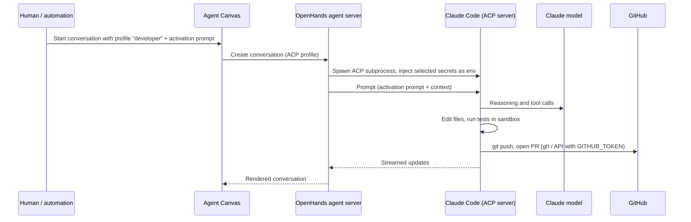

# ACP / Claude Code Integration

Three roles run Claude Code through the **Agent Client Protocol (ACP)** inside OpenHands. This
document explains why, how it is wired, what must be configured outside Git, and the current
limitations.

> **Verification note.** *Official* statements were checked against the OpenHands documentation
> (Agent Canvas "ACP Agents", "Agent Profiles" and SDK "ACP Agent" pages) on 2026-10-01. Exact
> field names and behaviour depend on the installed OpenHands, ACP adapter and Claude Code
> versions; verify them in your installation. Nothing in this repository configures ACP
> automatically.

## 1. Intended architecture

```text
OpenHands Agent Profile (type: ACP)
        ↓
       ACP  (JSON-RPC over stdio)
        ↓
   Claude Code  (subprocess in the runtime)
        ↓
      Claude
```



*Official:* an ACP-type Agent Profile makes OpenHands spawn an ACP server subprocess and
communicate with it over JSON-RPC on stdio. The external agent manages its own model, tools,
context window and authentication; Agent Canvas renders the conversation.

## 2. Why ACP is used

- **Deep multi-file reasoning.** Architecture, implementation and semantic review require reading
  and correlating many files, running tools iteratively and keeping a coherent plan. Claude Code is
  built for this workflow.
- **Mature coding toolchain.** Claude Code brings its own file editing, search, shell and git
  tooling, project memory (`CLAUDE.md`) and skills support.
- **One platform.** ACP lets these roles run inside the same OpenHands installation, sandboxes and
  conversation UI as the other roles, instead of a separate service.

## 3. Which profiles use ACP

| Profile | Backend | Reason |
| --- | --- | --- |
| `architect` | ACP · Claude Code | Whole-repository analysis, trade-off reasoning, ADR writing |
| `developer` | ACP · Claude Code | Multi-file implementation, test-driven iteration |
| `code-reviewer` | ACP · Claude Code | Semantic review across diff, callers, tests and design |

## 4. Which profiles do not

Product Manager, Researcher, Planner, QA Engineer, Security Reviewer and Orchestrator run on the
built-in OpenHands agent with an LLM profile. They stay **model-agnostic**: their behaviour comes
from role files and Skills, so the model can be changed per profile for cost or quality without
changing this repository. A role moves to ACP only with a concrete reason recorded in an ADR (for
example, if security review quality requires Claude Code's whole-repository analysis).

## 5. Runtime configuration

*Official* (Agent Canvas): ACP agents are configured under `Settings > Agent`. The documented
settings are:

| Setting | Meaning | Value for this team |
| --- | --- | --- |
| `agent_kind` | OpenHands or ACP | ACP |
| `acp_server` | Which ACP server definition is used | Claude Code |
| `acp_command` | Command that launches the ACP subprocess | Default documented: `npx -y @agentclientprotocol/claude-agent-acp` — keep the default unless your installation requires a pinned version |
| `acp_model` | Model selection or override | Leave on the Claude Code default, or set per role if your version exposes it |

The profile's **secret scope** decides which OpenHands secrets are exported into the ACP
subprocess environment (*Official*: when the agent server supports `profile_secret_scope_v1`).

*Convention:* create three ACP profiles named `architect`, `developer` and `code-reviewer` with the
same ACP settings; they differ in their secret scope (all three: `GITHUB_TOKEN`, plus
`ANTHROPIC_API_KEY` if used) and in the activation prompt used to start them.

## 6. Authentication

*Official:* Claude Code via ACP supports two credential paths:

| Path | Where it lives | Precedence |
| --- | --- | --- |
| Subscription login | Claude Code's local credential store: macOS Keychain, or `~/.claude/.credentials.json` on Linux, inside the environment where the ACP subprocess runs | Takes precedence when present |
| API key | `ANTHROPIC_API_KEY` environment variable, provided as an OpenHands secret of the same name | Used only when no subscription login exists |

Choose one path deliberately and document the choice in your runtime notes:

- **API key** — simplest to rotate and scope; billed per usage; stored in OpenHands secrets.
- **Subscription login** — performed interactively once in the runtime; the credential file then
  persists on the runtime's filesystem.

## 7. Credential persistence considerations

- A subscription login's credential file must survive container restarts **only** if you want to
  avoid re-login; if it persists, it lives on a volume of the OpenHands host. Protect that volume
  like any secret: restricted host access, no backups to untrusted storage, never mounted into
  repositories or copied into a workspace that is committed.
- Sandboxes are created per conversation in many setups. Verify in your installation where the ACP
  subprocess runs (agent server vs. sandbox) and therefore where `~/.claude/` must exist.
- When both a subscription login and `ANTHROPIC_API_KEY` exist, the subscription wins
  (*Official*). Remove the one you do not intend to use to avoid surprises in billing and audit.
- Rotate credentials when a team member with access to the host leaves, and immediately if a
  credential appears in any log, Issue, Pull Request or commit.

## 8. Secret handling

- Never commit `~/.claude/`, `.credentials.json`, API keys or exported settings.
- Provide credentials only via OpenHands secrets (*Official*: exported as environment variables).
- Do not pass secrets in activation prompts or Issue text; agents must never echo them.
- Give ACP profiles only the secrets they need (secret scope "Selected").
- `CLAUDE.md` and Claude Code project settings committed to a target repository must contain
  instructions only, never credentials.

## 9. Repository vs runtime configuration

| In this repository (Git) | In the runtime (OpenHands / Claude Code) |
| --- | --- |
| Which roles use ACP and why (this document, [config/agents.yaml](../config/agents.yaml), ADR-0001) | The three ACP Agent Profiles and their settings |
| Role behaviour (role files, Skills, AGENTS.md) | Claude Code authentication (login or API key secret) |
| Activation prompts | Claude Code MCP configuration, if used |
| Permission specification | Secret scope per profile |

## 10. Skills and AGENTS.md for ACP profiles

*Official / known issue:* OpenHands issue
[OpenHands/OpenHands#16905](https://github.com/OpenHands/OpenHands/issues/16905) reports that, in
the affected versions, Skills enabled in Agent Canvas did not reach Claude Code ACP sessions;
a fix was proposed in [OpenHands/OpenHands#17421](https://github.com/OpenHands/OpenHands/pull/17421).
Verify the behaviour of your installed version.

Mitigation (*Convention*), robust regardless of version:

1. Target repositories contain `CLAUDE.md` with `@AGENTS.md`, so Claude Code loads the team
   contract natively.
2. Optionally install the same Skills for Claude Code in its own skills directory
   (`.claude/skills/<name>/SKILL.md` in the target repository, or the user-level Claude Code skills
   directory in the runtime). The `SKILL.md` format of this repository is compatible.
3. The activation prompts of ACP roles instruct the agent to read its Skill file from this
   repository if the Skill is not visible in the session.

## 11. Tools and MCP for ACP profiles

*Official (SDK):* an ACP agent uses its own tools; OpenHands' MCP configuration is **not** passed to
ACP agents (`mcp_config` is not supported on the ACP agent). Therefore:

- **Repository / filesystem:** Claude Code's built-in file, search and shell tools.
- **GitHub:** `git` and the GitHub CLI or API inside the sandbox, authenticated through the
  `GITHUB_TOKEN` environment variable. Alternatively, configure the GitHub MCP server in Claude
  Code's own MCP configuration in the runtime (never commit a configuration that embeds a token).
- **Web:** Claude Code's built-in web tools, subject to your Claude Code permission settings.

## 12. Limitations

- Agent Profile cannot be changed mid-conversation (*Official*); start a new conversation for a
  different role.
- ACP settings and secret scoping depend on agent-server capabilities; older versions may expose
  fewer options.
- Skill visibility inside Claude Code sessions depends on the OpenHands version (section 10).
- Usage and cost of Claude Code are observed in the Anthropic console or subscription, not in
  OpenHands LLM profile metrics.
