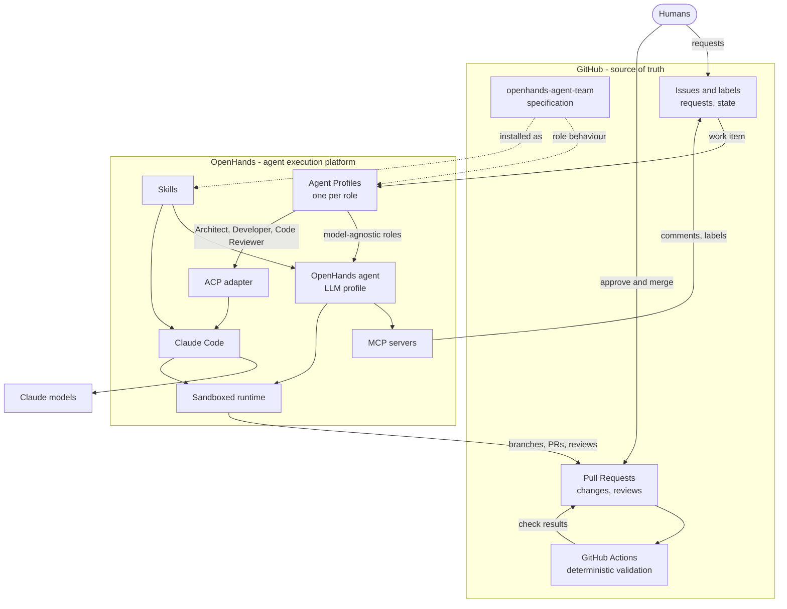
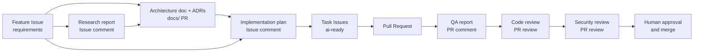

# Architecture

This document describes how the AI engineering team is built: its components, how they connect,
where configuration and state live, and how safety is enforced. The decision to use this
architecture, and the alternatives rejected, are recorded in
[ADR-0001](decisions/ADR-0001-agent-team-architecture.md).

## 1. Overview

## 2. Principles

1. **GitHub is the source of truth for project state.** Requirements, decisions, plans, code,
   reviews, test results and workflow state live in GitHub.
2. **OpenHands is the agent execution platform.** One installation runs all roles.
3. **Skills define reusable agent knowledge and procedures** ([skills/](../skills/README.md)).
4. **Agent Profiles define specialised roles** ([agents/](../agents/README.md)).
5. **MCP provides external tools and integrations** ([mcp-integration.md](mcp-integration.md)).
6. **ACP lets selected profiles use Claude Code** ([acp-integration.md](acp-integration.md)).
7. **GitHub Actions performs deterministic validation** ([automation.md](automation.md)).
8. **Humans retain final approval** for production-impacting changes.
9. **Minimal infrastructure.** Nothing is added without a documented requirement and an ADR.

## 3. Components

| Component | Responsibility | Where it lives | Specified in |
| --- | --- | --- | --- |
| GitHub repositories | Code, docs, ADRs of each application | GitHub | [github-integration.md](github-integration.md) |
| GitHub Issues and labels | Requests, requirements, tasks, workflow state | GitHub | [config/workflow.yaml](../config/workflow.yaml) |
| GitHub Pull Requests and reviews | Changes, QA reports, reviews, human approval | GitHub | [AGENTS.md](../AGENTS.md) |
| GitHub Actions | Lint, test, build, repository validation | GitHub | [automation.md](automation.md) |
| This repository | Behaviour, process, permissions, Skills, templates | GitHub | [README.md](../README.md) |
| OpenHands | Runs agent conversations in sandboxes | Self-hosted (for example on Coolify) | [openhands-integration.md](openhands-integration.md) |
| Agent Profiles | Select agent type, model or ACP agent, MCP servers and secrets per role | OpenHands runtime | [config/agents.yaml](../config/agents.yaml) |
| Skills | Procedures loaded by agents | Versioned here, installed into the runtime | [skills/README.md](../skills/README.md) |
| MCP servers | GitHub, filesystem/repository, web/research tools | Configured in the runtime | [mcp-integration.md](mcp-integration.md) |
| ACP + Claude Code | Execution backend for Architect, Developer, Code Reviewer | Launched by OpenHands as a subprocess | [acp-integration.md](acp-integration.md) |

## 4. The team

Nine roles, each an Agent Profile with a role file and one or more Skills:

| Role | Backend | Stage |
| --- | --- | --- |
| [Product Manager](../agents/product-manager.md) | Subagent · haiku | product-definition |
| [Researcher](../agents/researcher.md) | Subagent · sonnet | research |
| [Architect](../agents/architect.md) | Subagent · opus | architecture |
| [Planner](../agents/planner.md) | Subagent · sonnet | planning |
| [Developer](../agents/developer.md) (generalist + 10 stack specialists, ADR-0003) | Subagents · sonnet | in-development |
| [QA Engineer](../agents/qa-engineer.md) | Subagent · haiku | bug-reproduction, qa |
| [Code Reviewer](../agents/code-reviewer.md) | Subagent · sonnet | code-review |
| [Security Reviewer](../agents/security-reviewer.md) | Subagent · sonnet | security-review |
| [Orchestrator](../agents/orchestrator.md) | Coordinator (sonnet) | coordination |

The lifecycle that connects them is described in [workflow.md](workflow.md).

## 5. Configuration layers

| Layer | Source of truth | Contents | Changed by |
| --- | --- | --- | --- |
| Behaviour and process | This repository | AGENTS.md, role files, Skills, templates, workflow, permissions, ADRs | Pull Request + human review |
| Project knowledge | Each target repository | Its own `AGENTS.md`, `docs/architecture/`, `docs/decisions/`, code | Pull Requests through the workflow |
| Runtime configuration | OpenHands | Agent Profiles, LLM profiles, MCP servers, ACP settings, secrets | Human administrator in OpenHands |
| Validation | GitHub Actions workflows | Deterministic checks | Pull Request + human review |
| Access control | GitHub settings and OpenHands profiles | Branch protection, CODEOWNERS, token scopes, secret scope | Human administrator |

The YAML files in [config/](../config/agents.yaml) are **specifications**. OpenHands does not read
them; an administrator configures OpenHands to match them (checklist in
[openhands-integration.md](openhands-integration.md#3-runtime-setup-checklist)).

## 6. Enforcement model

Rules are enforced at two strengths ([config/permissions.yaml](../config/permissions.yaml)):

| Strength | Mechanism | Examples |
| --- | --- | --- |
| **Hard** | Systems the agent cannot bypass | Branch protection on `main`; required human code-owner approval; required status checks; token scopes; OpenHands secret scope and MCP references per profile; sandbox isolation |
| **Soft** | Instructions + review | Role boundaries (who edits which paths), templates, label hand-offs, "never APPROVE" |

Every production-impacting action (merge, deployment, secret access) is protected by at least one
hard control. Soft controls add precision and are checked by the review stages and by humans.

## 7. Data and artifact flow

Every arrow is a GitHub link: each artifact references the artifacts it was built from.

## 8. Deliberately excluded (initial phase)

LiteLLM, n8n as primary orchestrator, Mattermost, Kubernetes, a server or container per agent,
multiple OpenHands instances, a separate project-management platform and a separate agent
database are **not used initially**. Each can be introduced later through an ADR when a
documented requirement justifies its operational cost. See
[ADR-0001](decisions/ADR-0001-agent-team-architecture.md#alternatives).

## 9. Known constraints

- OpenHands runtime configuration is manual; drift from the specification is possible.
- Exact OpenHands configuration fields depend on the installed version; the integration documents
  separate verified facts from repository conventions.
- ACP agents manage their own tools; OpenHands MCP configuration is not passed to them (see
  [acp-integration.md](acp-integration.md#11-tools-and-mcp-for-acp-profiles)).
- Automation is phased; see [automation.md](automation.md).
