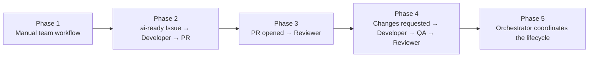

# Automation

Automation is introduced **in phases**. Each phase automates one narrow hand-off, runs long enough
to prove it is reliable and safe, and only then is the next phase started. The first
implementation is deliberately **not** a fully autonomous system.

Two layers are always kept separate:

| Layer | Nature | Tool | Example |
| --- | --- | --- | --- |
| Deterministic validation | Same input → same result; no AI | GitHub Actions | Lint, tests, build, repository validation, PR convention checks |
| Semantic reasoning | Judgement; may vary | OpenHands agents | Requirements, design, implementation, review |

Deterministic validation never depends on OpenHands being online.

## Phase overview



| Phase | Status | Automated trigger | Human role |
| --- | --- | --- | --- |
| 1. Manual execution | **Current** | None (only deterministic Actions) | Starts every agent conversation |
| 2. Issue → Developer → PR | Planned | `ai-ready` label on a task Issue | Reviews and merges |
| 3. PR → Reviewer | Planned | PR marked ready / labelled `agent:reviewer` | Reviews and merges |
| 4. Feedback loop | Planned | `CHANGES REQUESTED` / QA `FAIL` | Reviews and merges; resolves loops |
| 5. Orchestrated lifecycle | Future | Orchestrator decides next stage | Approval points only |

## Phase 1 — Manual execution (current)

**What happens:** humans start each agent conversation in OpenHands with the right Agent Profile
and activation prompt ([openhands-integration.md](openhands-integration.md#6-starting-work-phase-1)).
Agents persist artifacts and hand off labels; GitHub Actions validates deterministically.

**Automated today (deterministic only):**

- [validate-repository.yml](../.github/workflows/validate-repository.yml) — validates this repository.
- [ai-workflow.yml](../.github/workflows/ai-workflow.yml) — deterministic gates around hand-offs:
  - when `ai-ready` is added to an Issue, checks that the task contains every required section; if
    not, removes `ai-ready`, returns the Issue to `agent:planner` and comments what is missing;
  - on Pull Requests, checks branch naming, the linked Issue, the template sections and the
    single-`agent:*`-label rule, and writes a job summary naming the Agent Profile that owns the
    next step.

**Exit criteria to start phase 2:**

- [ ] At least 10 task Issues completed end to end with the manual workflow.
- [ ] Developer Pull Requests pass QA on the first cycle in most cases, and no agent action
      required reverting a merged change.
- [ ] Branch protection verified: the agent identity cannot merge or push to `main`.
- [ ] Runtime configuration matches [openhands-integration.md](openhands-integration.md).

## Phase 2 — Issue `ai-ready` → Developer → PR

```text
Issue labeled ai-ready
        ↓
Developer
        ↓
Branch
        ↓
Implementation
        ↓
Tests
        ↓
Pull Request
        ↓
Reviewer
```

**Trigger:** the `ai-ready` label is added to a task Issue by the Planner or a human, *and* the
deterministic readiness gate in `ai-workflow.yml` passes.

**Action:** start an OpenHands conversation with the `developer` profile on the target repository,
with the Developer activation prompt and the Issue number.

**Integration options** (choose one; verify against your installed version before building it):

| Option | Status of documentation | Notes |
| --- | --- | --- |
| OpenHands event-based automations | *Official* for OpenHands Cloud with the OpenHands GitHub App (triggers on `issues` labeled, `pull_request` events, filters with JMESPath) | Verify availability for self-hosted installations before relying on it |
| GitHub Actions job calling the OpenHands REST API to create a conversation | OpenHands documents a V1 REST API for conversations and sandboxes; exact endpoints and authentication depend on the version | Requires exposing the OpenHands API to GitHub-hosted runners or using a self-hosted runner; store `OPENHANDS_API_URL` and `OPENHANDS_API_KEY` as Actions secrets |
| OpenHands Software Agent SDK GitHub workflows | *Official* examples run an agent inside the Actions runner (for example PR review triggered by a label) using an `LLM_API_KEY` secret | Runs outside the self-hosted OpenHands installation; a different trust and cost model that needs its own ADR |

Until one option is verified and adopted through an ADR, `ai-workflow.yml` stays deterministic
and a human starts the Developer.

**Guards (required before enabling):**

- Kill switch: a repository variable (convention: `AI_AUTOMATION_ENABLED`) checked by every
  automated trigger.
- Concurrency: one Developer run per Issue; a second trigger on the same Issue is ignored.
- Trusted triggers only: labels can be added only by users with triage/write access; never trigger
  from fork Pull Requests or from `pull_request_target` with untrusted code.
- Budget: a maximum number of automated runs per day, reviewed weekly.
- No auto-merge; branch protection unchanged.

**Exit criteria:** 20 automated Developer runs with no guard violations, no secret exposure, and a
human-acceptable PR quality rate.

## Phase 3 — PR opened → Reviewer

```text
Pull Request
      │
      ├── GitHub Actions   (deterministic: build, lint, tests)
      │
      └── AI Reviewer      (semantic: code-review Skill)
```

**Trigger:** the Pull Request is labelled `agent:reviewer` (after QA `PASS`) — or, in a reduced
setup without automated QA, marked ready for review with green required checks.

**Action:** start the `code-reviewer` profile with the Pull Request number; then, on
`NO BLOCKING FINDINGS`, the `security-reviewer` profile.

**Exit criteria:** reviewer findings are judged accurate by humans in most cases; no false
`NO BLOCKING FINDINGS` on a PR later reverted for a defect the review should have caught.

## Phase 4 — Changes requested → Developer → QA → Reviewer

```text
Changes requested
    ↓
Developer
    ↓
QA
    ↓
Reviewer
```

**Trigger:** a review outcome `CHANGES REQUESTED` or a QA verdict `FAIL` moves the label to
`agent:developer`.

**Action:** start the `developer` profile on the same branch; on hand-off start `qa-engineer`, then
`code-reviewer` and `security-reviewer`.

**Guard:** `loop_limits.max_review_cycles_per_pull_request` (3) from
[config/workflow.yaml](../config/workflow.yaml); exceeding it adds `blocked` + `needs-human` and stops
automation for that Pull Request.

## Phase 5 — Orchestrated lifecycle

Only after phases 2–4 are proven does the Orchestrator coordinate the complete lifecycle
automatically: it reads GitHub state, applies labels and starts the next profile through the
mechanism adopted in phase 2. Human approval points remain unchanged: ADR acceptance, risk
acceptance, team-configuration changes and every merge.

Moving to phase 5 requires an ADR that records the evidence from phases 2–4.

## What is never automated

- Merging into protected branches, approving Pull Requests, enabling auto-merge.
- Accepting ADRs or risks.
- Changing team configuration, branch protection or secrets.
- Deployments to production.

## Secrets used by automation

| Secret / variable | Where | Phase | Purpose |
| --- | --- | --- | --- |
| `GITHUB_TOKEN` (automatic) | GitHub Actions | 1+ | Deterministic workflows (scoped by each job's `permissions`) |
| `AI_AUTOMATION_ENABLED` (variable) | GitHub Actions | 2+ | Kill switch |
| `OPENHANDS_API_URL`, `OPENHANDS_API_KEY` | GitHub Actions secrets | 2+ (REST option only) | Start OpenHands conversations |

Names marked for later phases are conventions; they are not used by any workflow today.
