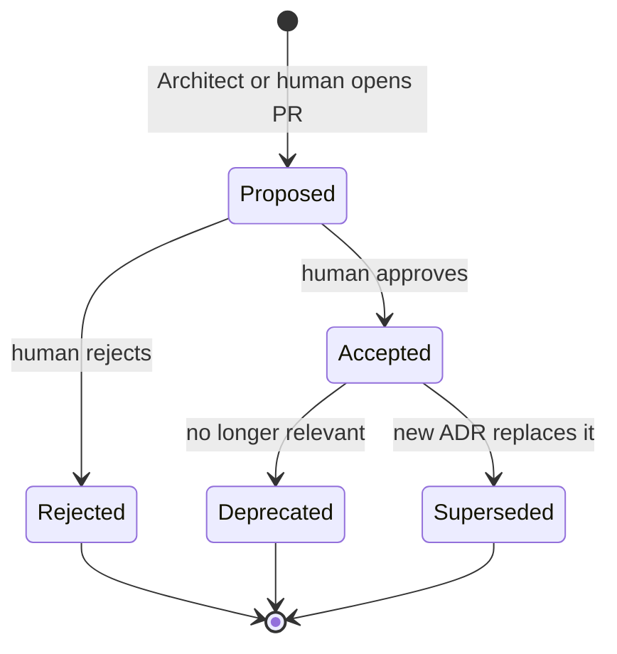

# Architecture Decision Records

An **Architecture Decision Record (ADR)** captures one significant decision, its context, the
alternatives considered and its consequences. ADRs are the memory of *why* the system — or this
team — is shaped the way it is.

This directory holds the ADRs for the **agent team itself**. Target application repositories keep
their own ADRs in their own `docs/decisions/` directory using the same process and the same
[template](../../templates/adr.md).

## Index

| ADR | Title | Status | Date |
| --- | --- | --- | --- |
| [ADR-0001](ADR-0001-agent-team-architecture.md) | Use GitHub, OpenHands, Agent Profiles, Skills, MCP, ACP / Claude Code and GitHub Actions as the agent team architecture | Accepted | 2026-10-01 |
| [ADR-0002](ADR-0002-single-session-subagent-team.md) | Run the team as one coordinator session with Claude Code subagents (amends ADR-0001) | Accepted | 2026-10-05 |
| [ADR-0003](ADR-0003-stack-specialist-developers.md) | Run the Developer role as stack specialists chosen by the coordinator (extends ADR-0002) | Proposed | 2026-10-07 |

Keep this index updated in the same Pull Request that adds or changes an ADR.

## When an ADR is required

Write an ADR when a decision is **significant and expensive to reverse**, in particular:

- Choosing or replacing a framework, language, data store, message broker or major library.
- Defining or changing a public API contract, an event schema or a data model shared across components.
- Creating, moving or removing a trust boundary, or changing the authentication / authorization model.
- Introducing new infrastructure, a hosted service or a vendor with cost or lock-in.
- Changing deployment topology, environments or the release process.
- Deliberately deviating from an existing ADR or established convention.
- For this repository: adding or removing an agent, changing an agent's execution backend, changing
  the lifecycle, the human approval points, or the permission model.

An ADR is **not** required for decisions that are local, cheap to reverse and covered by existing
conventions (naming inside a module, choice between equivalent helper functions, refactors that
keep interfaces).

When in doubt, the Architect or a human reviewer decides; the default is to write a short ADR.

## Naming

```text
docs/decisions/ADR-NNNN-kebab-case-title.md
```

- `NNNN` is a zero-padded, monotonically increasing number. Take the next free number at the time
  the Pull Request is opened; if two PRs collide, the one merged second renumbers.
- Numbers are never reused, even for rejected ADRs.
- The title is short, imperative and names the decision, not the problem:
  `ADR-0007-store-login-throttling-state-in-primary-database.md`.

## Format

Use [templates/adr.md](../../templates/adr.md). Required sections:

1. **Status**
2. **Context**
3. **Decision**
4. **Alternatives**
5. **Consequences**
6. **Security considerations**
7. **Operational considerations**

## Lifecycle



| Status | Meaning | Who sets it |
| --- | --- | --- |
| `Proposed` | Written and under discussion. Planning must not depend on it. | Author (Architect agent or human) |
| `Accepted` | In force. All work must comply. | A human, through an approving review on the ADR's Pull Request |
| `Rejected` | Considered and not adopted. Kept for the record. | A human |
| `Deprecated` | No longer relevant (for example, the feature was removed); not replaced. | A human |
| `Superseded by ADR-NNNN` | Replaced by a newer ADR. | A human, in the Pull Request that accepts the new ADR |

Rules:

- Agents may write `Proposed` ADRs; **only humans change an ADR's status** (approval point
  `adr-acceptance` in [config/workflow.yaml](../../config/workflow.yaml)).
- An ADR may be merged as `Proposed` so that it can be discussed and linked, or merged directly as
  `Accepted` when the human reviewer approves the decision in the same Pull Request.
- After acceptance, the Context, Decision and Alternatives sections are **immutable**. Typos may be
  fixed; meaning may not change.

## Handling superseded decisions

Decisions change; history does not. To change an Accepted decision:

1. Write a new ADR that describes the new context, the new decision and why the old one no longer
   fits. Fill its `Supersedes` field with the old ADR number.
2. In the same Pull Request, change the old ADR's status line to
   `Superseded by [ADR-NNNN](ADR-NNNN-title.md)`. Do not edit anything else in the old ADR.
3. Update the index table above.
4. Create follow-up Issues for work required to migrate from the old decision to the new one.

A deprecated ADR is handled the same way without a successor: only its status line changes, and the
reason is recorded in the Pull Request description.
