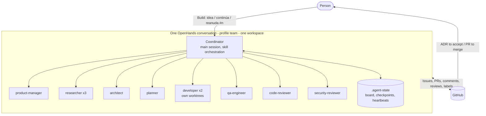

# Subagent Team

The team runs in **one OpenHands conversation** with the ACP Agent Profile `team` (Claude Code). The
main session is the **coordinator**; every role is a Claude Code **subagent** with its own context,
model, tools and skills. The decision and its trade-offs are in
[ADR-0002](decisions/ADR-0002-single-session-subagent-team.md); this document is the operating guide.

## 1. Overview



The person writes one message; the coordinator delegates stage after stage and stops only at the human
gates: **accepting an ADR** (merging its docs Pull Request) and **merging a Pull Request**. Gates are per
work item: while one item waits, independent items continue.

## 2. Catalogue

Canonical values are `runtime` in [config/agents.yaml](../config/agents.yaml); the subagent files in
[templates/runtime/claude/agents/](../templates/runtime/claude/agents/) are generated from them and the
validator checks that they agree.

| Agent | Model | Effort | Turns | Budget (min) | Escalation | Level | Parallel |
| --- | --- | --- | --- | --- | --- | --- | --- |
| Coordinator (orchestrator) | sonnet | medium | — | — | — | R0 | 1 |
| product-manager | haiku | medium | 30 | 10 | sonnet | R2 | 1 |
| researcher | sonnet | medium | 40 | 20 | opus | R1 | 3 |
| architect | opus | high | 60 | 30 | — (failure → `needs-human`) | R3 | 1 |
| planner | sonnet | high | 40 | 15 | opus | R2 | 1 |
| developer | sonnet | medium | 120 | 45 | opus | R4 | 2 (worktrees) |
| qa-engineer | haiku | medium | 50 | 20 | sonnet | R1 | 2 |
| code-reviewer | sonnet | high | 50 | 20 | opus | R1 | 2 |
| security-reviewer | sonnet | high | 50 | 20 | opus | R1 | 2 |

Every subagent preloads only its skills, keeps lessons in user-scope memory
(`~/.claude/agent-memory/<agent>/MEMORY.md`) and ends with the **result contract**:

```text
STATUS: DONE | BLOCKED | PARTIAL | FAILED
ARTIFACTS: links
EVIDENCE: commands and results
NEXT: what the coordinator should do next
CHECKPOINT: .agent-state/items/<n>.md
```

## 3. Restriction levels and harness

| Level | Agents | May write | Blocked by hooks |
| --- | --- | --- | --- |
| R0 | coordinator | `.agent-state/` | Any git write, merges, approvals |
| R1 | researcher, qa-engineer, code-reviewer, security-reviewer | Own memory and `.agent-state/` | Any git write; files elsewhere |
| R2 | product-manager, planner | Own memory and `.agent-state/` (Issues and comments through `gh`) | Any git write; files elsewhere |
| R3 | architect | `docs/architecture/`, `docs/decisions/`, `docs/research/` | Pushes other than `docs/*` branches |
| R4 | developer | Task files in its worktree | `.github/workflows/`, secret files, pushes other than `feature/`, `bugfix/`, `refactor/` or `chore/` branches |

For everyone, the hooks deny: pushes to `main` or `master`, force pushes, `git merge` while on `main`,
`gh pr merge`, approvals, merge or branch-protection API calls, git identity changes, `--no-verify` and
recursive deletes of `/` or the home directory. Unknown subagents (for example `Explore`) are treated
as R1.

**Harness** ([templates/runtime/claude/settings.json](../templates/runtime/claude/settings.json)):

| Setting | Value | Why |
| --- | --- | --- |
| `autoMemoryEnabled` | `true` | Required for subagent memory |
| `fallbackModel` | sonnet, haiku | Overload or unavailability of a model (one turn) |
| `CLAUDE_CODE_MAX_SUBAGENT_SPAWN_DEPTH` | 1 | Subagents never spawn subagents |
| `CLAUDE_CODE_MAX_CONCURRENT_SUBAGENTS` | 4 | Global parallelism cap |
| `CLAUDE_CODE_EXPERIMENTAL_AGENT_TEAMS` | 0 | Named subagents stay subagents |
| `TEAM_REPO` | `<owner>/openhands-agent-team` | Where agents read rules and templates |
| Hooks | see section 8 | Deterministic limits and state |

## 4. Parallelism

| Allowed in parallel | Condition |
| --- | --- |
| Up to 3 researchers | Independent questions |
| 2 developers | No unmet dependency and disjoint `Touches:` sets (declared by the planner), own worktree and branch |
| code-reviewer with security-reviewer | Same Pull Request, after QA `PASS` |
| Reviews of one Pull Request while a developer works on another task | Always |

Never in parallel: product definition, architecture and planning of one feature; two agents on one
branch; a task that depends on an unmerged Pull Request; QA or reviews of an outdated commit.

## 5. Time budgets and model escalation

Claude Code has no built-in "switch model after N minutes", so the coordinator applies this policy:

1. The `PostToolUse` hook writes `.agent-state/heartbeat/<agent_id>.json` on every tool call.
2. Escalate when the result is `PARTIAL`, no heartbeat arrives for 10 minutes (stop it with `TaskStop`),
   the budget is exceeded without checkpoint progress, or the same validation fails twice.
3. Continue the same subagent with `SendMessage` when it is alive; otherwise delegate the same brief again
   with the invocation `model` parameter set to the next model of the role's `escalation` list. The brief
   points to the checkpoint and the branch, so work continues instead of restarting.
4. One escalation per item; a second failure becomes `blocked` + `needs-human`.
5. API or usage-limit errors: the `StopFailure` hook writes `.agent-state/paused.json`; the next start
   resumes from the checkpoints.

## 6. Memory and context

| Layer | Where | What | Who |
| --- | --- | --- | --- |
| L1 GitHub | Issues, Pull Requests, comments, reviews | Requirements, plans, reports, verdicts | Everyone |
| L2 Checkpoint | `.agent-state/items/<n>.md` + a "Checkpoint" comment on the item | Goal, done, next, branch, last commit, validation, attempt, model | The working subagent |
| L3 Team board | `.agent-state/board.md` + a "Team board" comment on the feature Issue | Items, states, owners, agent ids, timings, waits | Coordinator |
| L4 Individual memory | `~/.claude/agent-memory/<agent>/MEMORY.md` | Lessons for the role across projects (≤ 200 lines) | Each subagent |
| L5 Project knowledge | The project's `AGENTS.md` | Commands, conventions, pitfalls | Through Pull Requests |

Context rules:

- The coordinator sends a **brief** (work item, directory, checkpoint, inputs, constraints, done-when),
  never the conversation.
- Subagents answer with the **result contract** (≤ 40 lines); the `SubagentStop` hook asks once for it
  when it is missing.
- The coordinator keeps only the board and reads full artifacts only to decide a transition.
- `.agent-state/` is excluded from git by the `SessionStart` hook (`.git/info/exclude`).

## 7. Recovery

| What stopped | How work continues |
| --- | --- |
| A subagent | `SendMessage` to resume it, or a new subagent from the checkpoint on the same branch |
| A developer before the end | Its draft Pull Request and pushed commits hold the work; the next developer starts from them |
| Context compaction | `PreCompact` snapshots the board; `SessionStart` re-injects it |
| Usage limit or API error | `paused.json` tells the next run to resume from checkpoints |
| The conversation | A new conversation with `reanuda #<issue>` rebuilds from the GitHub "Team board" and "Checkpoint" comments |

## 8. Validations and preventions

| Layer | File | Effect |
| --- | --- | --- |
| `PreToolUse` Bash | `hooks/guard-bash.mjs` | Global denials and per-level git limits |
| `PreToolUse` Edit/Write | `hooks/guard-files.mjs` | Per-level write paths, no secret files, no workflow files |
| `PostToolUse` | `hooks/heartbeat.mjs` | Stall detection |
| `SubagentStop` | `hooks/subagent-stop.mjs` | Result contract, event log |
| `SessionStart` | `hooks/session-start.mjs` | Excludes `.agent-state/`, re-injects the board |
| `PreCompact` | `hooks/pre-compact.mjs` | Board snapshot |
| `StopFailure` | `hooks/stop-failure.mjs` | Pause marker |
| git `commit-msg` | `githooks/commit-msg` | Conventional Commits, no `Co-Authored-By` |
| git `pre-push` | `githooks/pre-push` | Never `main`, branch names, secret scan |
| GitHub | branch protection, squash only, `pr-conventions`, `ci` | Pull Requests cannot merge with `changes-requested` or failing checks |

All of them are tested in CI: `node templates/runtime/claude/hooks/test-hooks.mjs` and
`node scripts/test_workflows.mjs`.

## 9. Token use

- haiku for product management and QA, sonnet by default, opus only for the architect and escalations.
- Effort per role; only the role's skills preloaded; fewer tools mean fewer tool schemas in context.
- Short briefs and result contracts; reviewers read `gh pr diff` and the touched files.
- One clone and one install per conversation; worktrees share the git objects.
- Code and security reviews in parallel instead of in sequence.

## 10. Installing the runtime

Run once per OpenHands deployment, as an administrator. `<VOL>` is the host path of the volume mounted at
`/home/openhands/.claude` (find it with `findmnt -T ~/.claude` inside the container), and `10001` the
container user.

1. Copy the files into the volume and give them to the container user:

   ```bash
   git clone --depth 1 https://github.com/<owner>/openhands-agent-team.git /tmp/team
   sudo cp -R /tmp/team/templates/runtime/claude/agents /tmp/team/templates/runtime/claude/hooks \
     /tmp/team/templates/runtime/claude/githooks /tmp/team/templates/runtime/claude/settings.json <VOL>/
   sudo cp /tmp/team/templates/runtime/claude-user-memory.md <VOL>/CLAUDE.md
   sudo mkdir -p <VOL>/skills && sudo cp -R /tmp/team/skills/*/ <VOL>/skills/
   sudo chmod 755 <VOL>/githooks/*
   sudo chown -R 10001:10001 <VOL>
   ```

   Then edit `TEAM_REPO` in `<VOL>/settings.json` (and `<owner>` in `<VOL>/CLAUDE.md` if present) to the real owner.
2. In the deployment's environment variables (for example Coolify), activate the git hooks and keep the
   identity variables:

   ```text
   GIT_CONFIG_COUNT=1
   GIT_CONFIG_KEY_0=core.hooksPath
   GIT_CONFIG_VALUE_0=/home/openhands/.claude/githooks
   GIT_AUTHOR_NAME / GIT_AUTHOR_EMAIL / GIT_COMMITTER_NAME / GIT_COMMITTER_EMAIL
   ```

3. In OpenHands, create the Agent Profile `team`: type ACP, Claude Code, model `sonnet`,
   `acp_prompt_timeout` 3600, secret scope Selected with `GITHUB_TOKEN`. The previous per-role profiles
   are no longer needed.
4. In each target repository: labels from `config/workflow.yaml` (including `changes-requested`),
   `pr-conventions.yml` and `ci.yml` from [templates/target-repo/](../templates/target-repo/README.md),
   squash-only merging and branch protection.
5. Check: start a conversation with `team` and write `estado`. The coordinator must answer as
   coordinator and list the subagents.

## 11. Using the team

| You write | What happens |
| --- | --- |
| `Build: <idea>` | New feature: requirements, design, plan, tasks, pull requests |
| `Fix: <bug>` | Reproduction, task, fix |
| `continúa` | After you merged a Pull Request or accepted an ADR |
| `reanuda #<issue>` | In a new conversation, to continue a feature |
| `estado` | Board and pending human actions |

The coordinator ends every run with a list of what waits on you (ADR Pull Requests, Pull Requests to
merge, `needs-human` questions) and what is still running.

## 12. Pilot checklist

- One message reaches the ADR, and after accepting it the pull requests, without other questions.
- At most two developers at once, in different worktrees and branches; reviews run in parallel after QA.
- Every Pull Request: Conventional Commits, one `Closes`, `pr-conventions` and `ci` green, author is your
  identity, no co-author; nobody merged or pushed to `main`.
- Verdicts are review comments with headers and the `changes-requested` label when needed; reviewers did
  not edit files.
- Recovery drills: stop a developer mid-task, close the conversation and `reanuda`, force a low turn limit
  to see escalation.
- Asking an agent to `git push origin main` or `gh pr merge` is denied by a hook.

## 13. Known limits

- Whether the ACP adapter loads `~/.claude/agents`, hooks and settings, and supports worktree isolation
  and background subagents, is confirmed in the pilot; skills from `~/.claude/skills` are already loaded.
- With one GitHub identity, verdicts rely on the label and hooks; branch protection level 2 needs machine
  users.
- Usage of the subscription with opus in the architect and escalations is measured in the pilot.
