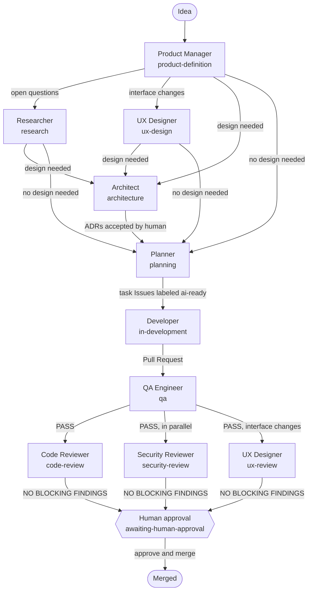
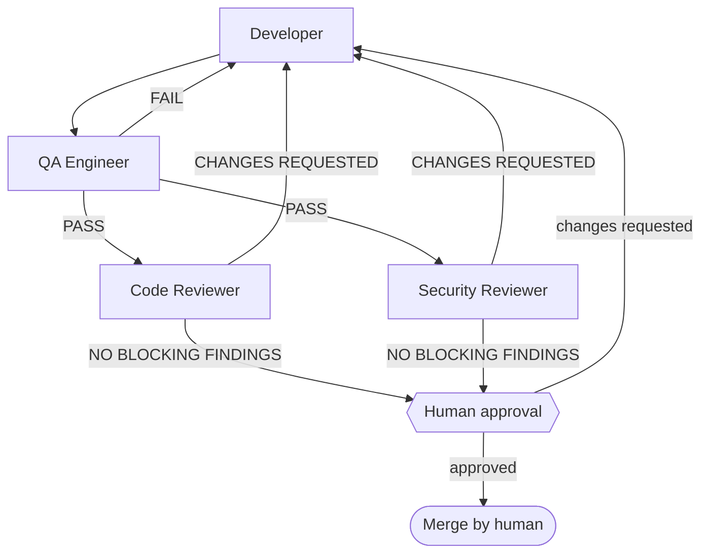
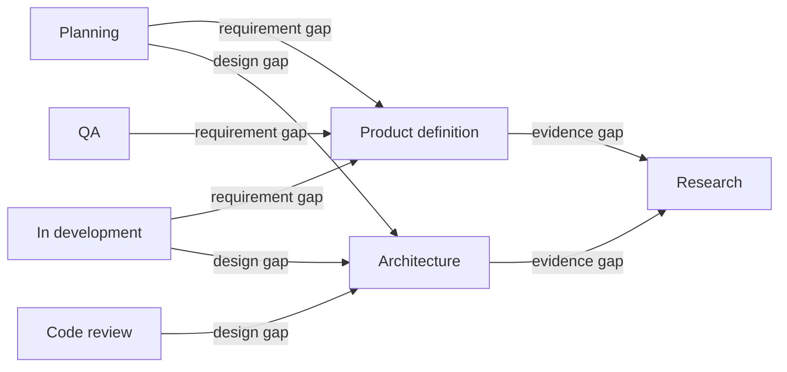
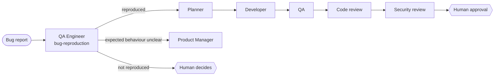
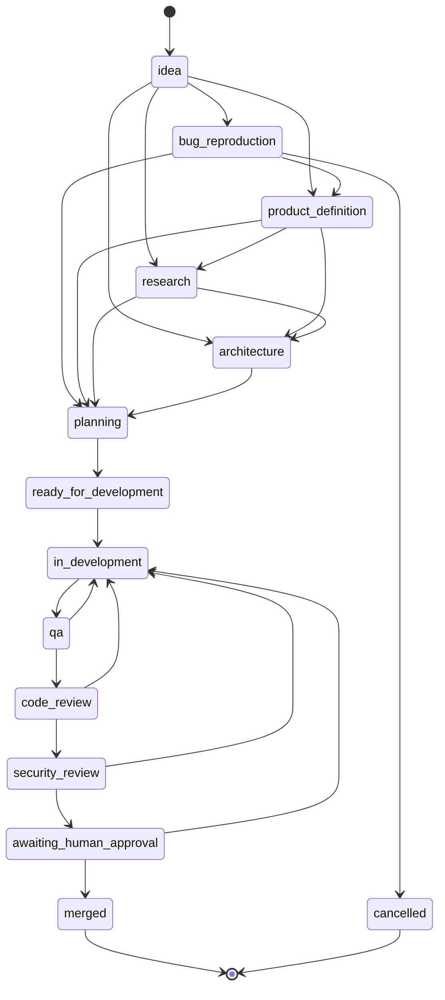

# Workflow

This document explains the complete engineering lifecycle: the stages, who owns each, how work
moves between agents, where feedback loops return work, and where humans decide. The canonical,
machine-readable definition is [config/workflow.yaml](../config/workflow.yaml); if this document
and the YAML disagree, the YAML wins and the discrepancy is a bug.

## 1. Lifecycle

```text
Idea → Product → Research → UX design → Architecture → Planning → Development → QA → Review, Security and UX review → Human approval → Merge
```



Research, UX design, architecture and UX review are **conditional** stages; their skip rules are in
`config/workflow.yaml` (`skip_when`): the UX stages run only for interface changes (ADR-0005). QA,
Code Review, Security Review and human approval are **never** skipped for a Pull Request. After QA
`PASS`, Code Review, Security Review and (for interface changes) UX Review run in parallel. All stages run as subagents of one coordinator session
([docs/subagents.md](subagents.md)); the team stops only for ADR acceptance and merges, per item.

## 2. Feedback loops



Every fix re-enters at QA, so a change is always validated, reviewed and security-reviewed in its
final form. After `max_review_cycles_per_pull_request` (3) cycles, the Pull Request is moved to
`blocked` + `needs-human`.

Upstream loops return work to the role that owns the missing information:



## 3. Bugs



## 4. States, owners and GitHub representation



State names in the diagram use underscores because Mermaid state identifiers cannot contain
hyphens; the canonical names use hyphens. Any state can move to `blocked`, and back to the state it
came from once the blocker is resolved; any state can be `cancelled` by a human.

| State | Owner | GitHub representation |
| --- | --- | --- |
| `idea` | human | Issue from a form, no agent label |
| `bug-reproduction` | QA Engineer | Bug Issue + `agent:qa` |
| `product-definition` | Product Manager | Issue + `agent:product` |
| `research` | Researcher | Issue + `agent:research` |
| `ux-design` | UX Designer | Feature Issue + `agent:ux` (conditional) |
| `architecture` | Architect | Issue + `agent:architect` |
| `planning` | Planner | Issue + `agent:planner` |
| `ready-for-development` | Developer | Task Issue + `ai-ready` + `agent:developer` |
| `in-development` | Developer | Task Issue + `agent:developer` (`ai-ready` removed), branch or draft PR exists |
| `qa` | QA Engineer | Pull Request + `agent:qa` |
| `code-review` | Code Reviewer | Pull Request + `agent:reviewer` |
| `security-review` | Security Reviewer | Pull Request + `agent:security` |
| `ux-review` | UX Designer | Pull Request + `agent:ux` (conditional, parallel) |
| `awaiting-human-approval` | human | Pull Request + `needs-human`, checks green |
| `merged` | human | Pull Request merged, task Issue closed |
| `blocked` | Orchestrator | `blocked` (+ `needs-human`) and an escalation comment |
| `cancelled` | human | Closed as not planned / PR closed unmerged |

## 5. Hand-off protocol

At the end of its stage, the owning subagent:

1. Persists its artifact in the location defined in [config/agents.yaml](../config/agents.yaml).
2. Replaces its own `agent:*` label with the next owner's label (exactly one `agent:*` label at a time,
   except `agent:reviewer` with `agent:security` during parallel review), and sets or removes
   `changes-requested` according to its verdict.
3. Updates its checkpoint (`.agent-state/items/<n>.md` and the "Checkpoint" comment) and returns the
   result contract to the coordinator.

The coordinator verifies the artifact on GitHub, updates the team board (`.agent-state/board.md` and the
"Team board" comment on the feature Issue) and delegates the next stage
([skills/orchestration](../skills/orchestration/SKILL.md)).

## 6. Human approval points

| Approval point | Stage | Required | What the human does |
| --- | --- | --- | --- |
| `requirements-sign-off` | product-definition | Recommended | Confirms scope and acceptance criteria of new features |
| `adr-acceptance` | architecture | Yes | Approves the ADR Pull Request; sets status `Accepted` |
| `risk-acceptance` | code-review, security-review | Yes | Accepts an open `HIGH` finding in writing on the PR |
| `merge-approval` | awaiting-human-approval | Yes | Approving review as code owner, then merge |
| `team-configuration-change` | any | Yes | Reviews changes to AGENTS.md, `config/permissions.yaml`, `config/workflow.yaml`, `.github/workflows/` |

**There is no automatic merge.** Agents never merge, never approve and never enable auto-merge.

## 7. Shared vocabulary

| Concept | Values |
| --- | --- |
| Severity | `BLOCKER`, `HIGH`, `MEDIUM`, `LOW`, `NIT` |
| QA result | `PASS`, `FAIL`, `BLOCKED`, `NOT APPLICABLE` |
| Review outcome | `CHANGES REQUESTED`, `NO BLOCKING FINDINGS`, `BLOCKED` |
| Research classification | `FACT`, `EVIDENCE`, `ASSUMPTION`, `INTERPRETATION`, `RECOMMENDATION` |
| Branch prefix | `feature/`, `bugfix/`, `refactor/`, `chore/`, `docs/` |

Definitions are in [config/workflow.yaml](../config/workflow.yaml).

## 8. Worked example

1. A human opens "Lock accounts after repeated failed logins" with the feature form → `idea`.
2. Orchestrator labels it `agent:product`. Product Manager writes FR-1, NFR-1, AC-1..AC-3, hands
   off to `agent:architect` (throttling state needs a storage decision).
3. Architect publishes `docs/architecture/120-login-throttling.md` and ADR-0007 (Proposed) in PR
   #131. A human approves; ADR-0007 is Accepted. Label → `agent:planner`.
4. Planner posts the plan and creates tasks #121–#123; #121 gets `ai-ready` + `agent:developer`.
5. Developer implements #121 on `feature/121-throttle-columns`, opens PR #140 → `agent:qa`.
6. QA reports `PASS` → `agent:reviewer`. Code Reviewer: `NO BLOCKING FINDINGS` → `agent:security`.
   Security Reviewer: `NO BLOCKING FINDINGS` → `needs-human`.
7. A human code owner approves and merges PR #140; #121 closes; the Planner marks #122 `ai-ready`.
