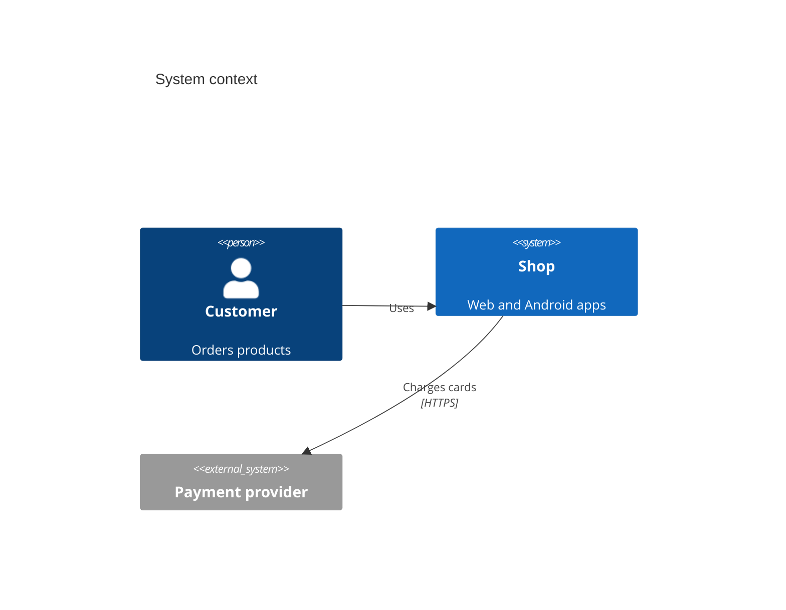

# Documentation structure and style: reference

Load this file when deciding where a page belongs or how to write it. It complements
[the skill](../SKILL.md).

## Structure

```text
README.md                  what it is, getting started, usage, development, documentation, licence
CHANGELOG.md               optional, Keep a Changelog
docs/
├── README.md              index of every section
├── tutorials/             learning: from zero to a working result
├── how-to/                tasks: configure, deploy, operate, troubleshoot
├── reference/             facts: API, configuration, commands, data model, errors
├── explanation/           understanding: concepts, rationale, trade-offs
├── architecture/          arc42 overview (overview.md) + per-feature documents (Architect)
├── decisions/             ADRs (Architect; status changes only by acceptance)
├── design/                UX specifications per feature (from the UX Designer)
└── research/              research reports (Researcher)
```

## Diátaxis decision table

| The reader... | Page type | Test |
| --- | --- | --- |
| is new and wants to learn | Tutorial | Can they follow it top to bottom and end with something working? |
| has a goal and needs steps | How-to | Does it solve exactly one task, with verification? |
| needs an exact fact | Reference | Is it complete, neutral and structured like the system? |
| wants to understand why | Explanation | Does it explain reasons and trade-offs without steps? |

## arc42 sections for `docs/architecture/overview.md`

1. Introduction and goals
2. Constraints
3. Context and scope (C4 context)
4. Solution strategy
5. Building block view (C4 container and component)
6. Runtime view (sequence diagrams)
7. Deployment view
8. Crosscutting concepts
9. Architecture decisions (link `docs/decisions/`)
10. Quality requirements
11. Risks and technical debt
12. Glossary

Keep sections short; mark a section "Not applicable" rather than inventing content.

## C4 in Mermaid



Use `flowchart` diagrams when the renderer of the project does not support C4 syntax.

## Style guide

- Headings say what the section helps to do ("Configure the database", not "Database").
- Sentences are short and active; steps are imperative and numbered; one action per step.
- Every command is copy-pasteable and real (from the stack profile or the code); placeholders in
  angle brackets (`<host>`, `<token>`).
- Code blocks declare the language; long output is trimmed with a note.
- Terms are defined once (glossary) and used consistently; acronyms expanded on first use.
- Links are relative inside the repository; no bare URLs in prose.
- Tables for comparisons and reference; lists for steps; prose for explanation.
- Dates in ISO format (2026-10-10); versions exact.

## README sections

| Section | Content |
| --- | --- |
| Title and overview | One or two sentences: what it does and for whom; badges (CI, licence) |
| Getting started | Prerequisites, installation, first run, with the real commands |
| Usage | Main workflows, commands, endpoints or screens, links to how-to and reference |
| Development | Branches, how to run tests and lint, how to contribute, link to AGENTS.md |
| Documentation | Link to `docs/README.md` and the main sections |
| Licence | Licence name and link |
