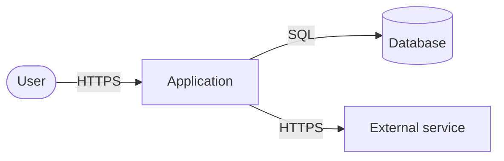

# Architecture: <feature or system name>

<!--
Owner: Architect · Skill: skills/architecture/SKILL.md
Persist as: docs/architecture/<issue>-<slug>.md in the target repository via a docs/ branch PR.
Every section is filled. If a concern is unaffected write "No change — <reason>".
Every decision states the requirement/constraint driving it and the rejected alternative.
-->

| Field | Value |
| --- | --- |
| Issue | #<n> |
| Requirements | #<feature issue> (FR-…, NFR-…) |
| Research | #<research issue> or "None" |
| ADRs | ADR-<NNNN> (Proposed / Accepted) |
| Status | Draft / In review / Approved by @<human> on <YYYY-MM-DD> |
| Author | Architect agent |

## 1. Summary

<Three to five sentences: what is being built, the chosen approach, and the key decision.>

## 2. Requirements addressed

| ID | Requirement | Architecturally significant? | Addressed by |
| --- | --- | --- | --- |
| FR-1 | <short text> | yes / no — <why> | <component / decision> |
| NFR-1 | <short text> | yes / no — <why> | <component / decision> |

## 3. Constraints

| Constraint | Type (hard / preference) | Source |
| --- | --- | --- |
| <e.g. must run on the existing Coolify host> | hard | <ADR or Issue link> |

## 4. Existing system

<Relevant current components, data flows and conventions, with file paths. Technical debt that
affects this design.>

## 5. Context

Trust boundaries: <list each boundary and what crosses it>.

## 6. Components

| Component | New / changed / unchanged | Responsibility | Owns data | Depends on |
| --- | --- | --- | --- | --- |
| <name> | <status> | <one sentence> | <entities> | <components> |

## 7. Interfaces and APIs

### <METHOD /path or operation name>

- **Purpose:** <one sentence>
- **Authentication / authorization:** <mechanism, required role/scope>
- **Request:** <shape, validation rules, limits>
- **Response:** <shape>
- **Errors:** <status/code → condition>
- **Idempotency / pagination / rate limits:** <behaviour>
- **Compatibility:** <versioning, impact on existing clients>

## 8. Data

| Entity | Fields (type) | Owner component | Classification | Retention |
| --- | --- | --- | --- | --- |
| <entity> | <field: type> | <component> | public / internal / personal / secret | <period / rule> |

- **Migrations:** <forward steps, rollback steps, order relative to deployment>
- **Consistency:** <transactions, constraints, concurrency control>
- **Indexes for known queries:** <query → index>

## 9. Security

- **Trust boundaries and controls:** <boundary → authentication, authorization, validation>
- **Secrets:** <which secrets, stored where, how injected at runtime>
- **Encryption:** <in transit, at rest>
- **Threats considered:** <threat → mitigation> (STRIDE pass per boundary)
- **Audit logging:** <events>

## 10. Reliability

| Dependency / failure mode | Detection | Behaviour (timeout, retry, fallback) | User impact |
| --- | --- | --- | --- |
| <dependency down> | <signal> | <behaviour> | <impact> |

Backups and recovery: <RPO/RTO if required, or "No change">.

## 11. Observability

- **Logs:** <event names and fields; no secrets or personal data>
- **Metrics:** <metric names, type, labels>
- **Traces:** <spans>
- **Alerts:** <symptom-based alert → threshold → runbook>

## 12. Performance

| Operation | Expected load | Latency budget (p95) | Source NFR | How it will be measured |
| --- | --- | --- | --- | --- |
| <operation> | <req/s> | <ms> | NFR-<n> | <test or metric> |

## 13. Scalability

<First bottleneck at 10× current load and the planned response. No design for unrequested scale.>

## 14. Deployment

- **Build and release:** <pipeline changes or "No change">
- **Configuration:** <new settings and defaults>
- **Rollout:** <feature flag, ordering with migrations>
- **Rollback:** <steps>

## 15. Cost

| Item | Chosen design | Main alternative |
| --- | --- | --- |
| Infrastructure | <estimate> | <estimate> |
| Licences / services | <estimate> | <estimate> |
| Operational effort | <on-call, maintenance> | <…> |

## 16. Alternatives considered

| Option | How it works | Pros | Cons | Decision |
| --- | --- | --- | --- | --- |
| A. <simplest option> | | | | Chosen / Rejected — <reason> |
| B. <option> | | | | Chosen / Rejected — <reason> |

## 17. Trade-offs

<Why the chosen design wins for these requirements, and what it gives up.>

## 18. Decisions and ADRs

| Decision | ADR | Status |
| --- | --- | --- |
| <decision> | [ADR-<NNNN>](../decisions/ADR-<NNNN>-<slug>.md) | Proposed |

## 19. Work packages for planning

1. <slice> — <components> — depends on <n or none>

## 20. Open questions and risks

| Item | Type | Impact | Owner |
| --- | --- | --- | --- |
| <item> | question / risk | <impact> | <role or @human> |
