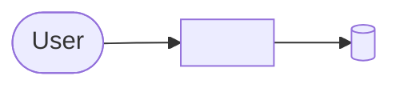

# Architecture overview

arc42 structure with C4 diagrams. Per-feature documents and ADRs are linked, not copied.

## 1. Introduction and goals

<Purpose, main quality goals, stakeholders.>

## 2. Constraints

<Technical and organisational constraints.>

## 3. Context and scope

## 4. Solution strategy

<Key technology and structural decisions, with ADR links.>

## 5. Building block view

<C4 container and component diagrams and their responsibilities.>

## 6. Runtime view

<Important scenarios as sequence diagrams.>

## 7. Deployment view

<Environments, infrastructure and how the system is deployed.>

## 8. Crosscutting concepts

<Security, error handling, logging, persistence, UX conventions.>

## 9. Architecture decisions

See `docs/decisions/README.md`.

## 10. Quality requirements

<Measurable quality scenarios.>

## 11. Risks and technical debt

<Known risks and debt with their mitigation.>

## 12. Glossary

| Term | Meaning |
| --- | --- |
| <term> | <definition> |
