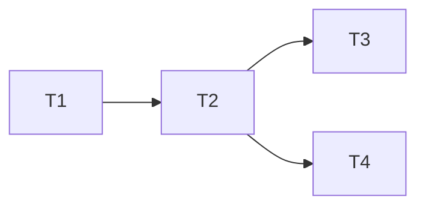

**Implementation plan** · Planner · state: planning

# Implementation plan: <feature name>

<!--
Owner: Planner · Skill: skills/planning/SKILL.md
Persist as: comment on the parent feature Issue. Task Issues are created separately using the
task form (.github/ISSUE_TEMPLATE/task.yml) sections and linked here.
-->

| Field | Value |
| --- | --- |
| Feature Issue | #<n> |
| Requirements | FR-1 … FR-<n>, NFR-1 … NFR-<n> |
| Architecture | <docs/architecture/… link> or "Not required — <skip_when reason>" |
| ADRs | ADR-<NNNN> (Accepted) or "None" |

## Approach

<Two to four sentences: how the work is sliced (vertical slices, enabling changes first) and why.>

## Affected components

| Component / path | Change | Tasks |
| --- | --- | --- |
| <src/module> | <what changes> | T1, T2 |

## Tasks

| Task | Issue | Title | Requirements | Depends on | Parallel with | Status |
| --- | --- | --- | --- | --- | --- | --- |
| T1 | #<n> | <title> | FR-1 | — | — | ai-ready |
| T2 | #<n> | <title> | FR-1, AC-1, AC-2 | T1 | — | waiting on T1 |
| T3 | #<n> | <title> | NFR-1, AC-3 | T2 | T4 | waiting on T2 |

## Traceability matrix

| Requirement | Acceptance criteria | Tasks |
| --- | --- | --- |
| FR-1 | AC-1, AC-2 | T1, T2 |
| NFR-1 | AC-3 | T3 |

## Testing strategy

| Level | Covered by tasks | Notes |
| --- | --- | --- |
| Unit | T2, T3 | <key cases> |
| Integration | T2 | <key cases> |
| E2E | — | <reason, or suite and flows> |
| Regression | T2 | <areas at risk> |

## Rollout and migration order

<Expand → migrate → contract sequence, feature flags, deployment ordering, or "No special ordering".>

## Risks

| Risk | Affected tasks | Mitigation |
| --- | --- | --- |
| <risk> | T<n> | <action> |

## Readiness

- Ready now (`ai-ready`): T1
- Waiting on dependencies (`agent:planner`): T2, T3
- Blocked (`blocked`): <task — reason — who can unblock> or "None"
