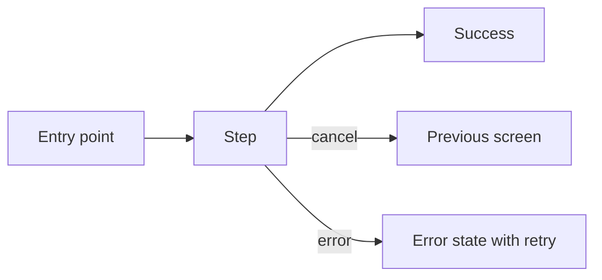

**UX specification** · UX Designer · state: ux-design

# UX specification: <feature title> (#<feature issue>)

## Users and goals

<Who uses this interface, in what context (device, platform, frequency), and what success looks like.>

## Platform and design system

- Platform: <web (react, nextjs, vue, angular) | Android (Kotlin, Jetpack Compose, Material 3)>
- Design system or theme: <existing theme, component library, tokens - or "none: tokens proposed below">
- Checklists applied: <`ux_search.py --checklist --platform ...` and `--stack ...`>

## Flows

## Screens

### <Screen name>

- Purpose:
- Layout (compact / expanded):
- Components:
- States: loading · empty · error · partial · success
- Copy: <labels, errors, empty-state text>

## Design tokens

| Token | Value | Contrast check |
| --- | --- | --- |
| <color role or text style> | <value> | <`contrast.py` ratio and AA result> |

## Accessibility

- Names and roles:
- Focus or TalkBack order:
- Touch targets: <48dp Android / 44px web>
- Text scaling:
- Color and contrast:
- Motion:

## UX acceptance criteria

- UX-AC-1: <Given / When / Then, testable>

## Open questions and assumptions

- <A-n: assumption and how to verify it>
